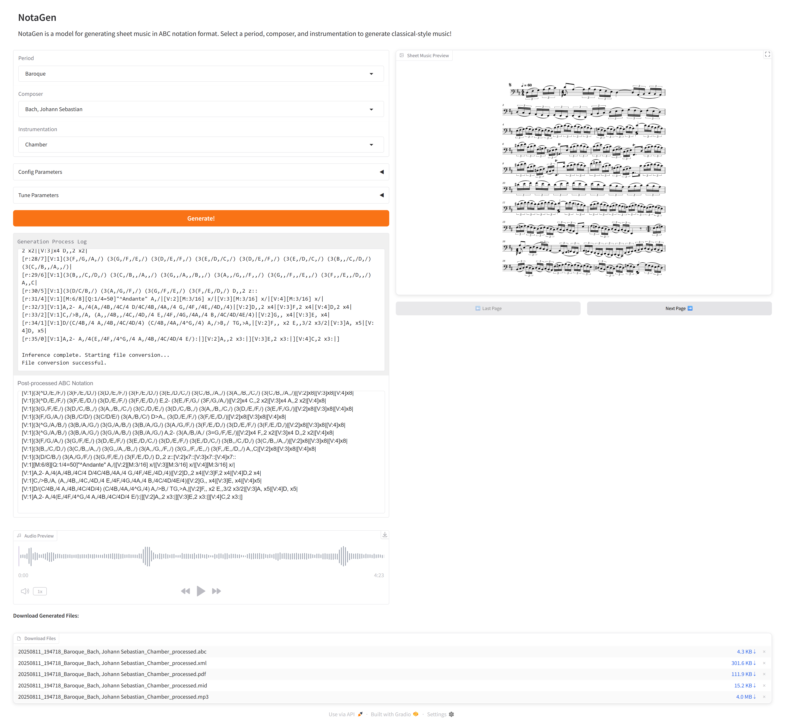

<p align="center">
<a href="https://colab.research.google.com/github/ariel-242/NotaGen_Gradio/blob/V2/NotaGen_Gradio.ipynb" target="_parent"></a>
</p>

# NotaGen Gradio Interface

Welcome to **NotaGen_Gradio**, an interactive Gradio interface for the [NotaGen](https://github.com/ElectricAlexis/NotaGen)  symbolic music generation model. This repository enables users to generate, preview, and download sheet music in ABC notation and MusicXML formats, leveraging the power of large language models trained on classical music. This interface is based on the interface in the NotaGen Repo of ElectricAlexis, and comes with additional features, and solves several problems.

## Features

- **Interactive Gradio Web UI:**  
  Generate sheet music by selecting musical parameters such as period, composer, and instrumentation. The interface supports conditional generation based on these choices.

- **Model Selection & Customization:**  
  - Choose from available models in the `models` directory.
  - Set a random seed for reproducible results, or let the system randomize it for creative exploration.
  - Tune generation parameters including:
    - **Top K**: Limits the number of most likely options considered at each step.
    - **Top P**: Controls nucleus sampling for diversity.
    - **Temperature**: Adjusts creativity/randomness.
    - **Number of Bars**: Specify the length of the generated piece.
    - **Key Signature & Time Signature:** Customize the generated music’s metadata.

- **Real-Time Generation Log:**  
  See process updates and streaming generation progress directly in the UI.

- **Sheet Music Preview & Audio Playback:**  
  - View generated scores as images (PDF preview with pagination).
  - Listen to synthesized audio for immediate feedback.

- **Download Options:**  
  Save generated files in ABC notation, MusicXML, and MP3 formats for further editing or sharing.

- **Metadata-Driven Prompting:**  
  Supports 112 prompt combinations based on the fine-tuning dataset, with plans to expand.

- **Google Colab Support:**  
  A ready-to-use Colab notebook is included for easy setup and GPU-powered inference.

## Problem-Solving & Improvements

- **Dynamic Markings Fixes:**  
  The inference pipeline (`inference.py`) includes robust fixes for handling dynamics:
  - **Crescendo (`cresc`) and Diminuendo (`dim`)**:  
    MuseScore won't generate the dynamic effects of Crescendo and Diminuendo in the output audio when converting from ABC notation. Automatic placement and correction of dynamic markers in generated ABC notation, ensuring accurate musical phrasing and proper voice assignment. Custom regex logic and voice-aware insertion routines resolve previous errors with dynamic regions.

- **Expanded Parameters:**  
  - Added controls for model name, seed, and additional "Tune Parameters" for more granular user control over generation.
  - Improved seed management for reproducibility and creative exploration.

## How to Use

1. **Environment Setup:**  
   - Clone the repo and install dependencies (see requirements.txt).
   - Download the NotaGen model weights from [HuggingFace](https://huggingface.co/ElectricAlexis/NotaGen).

2. **Run Locally:**  
   - Launch the Gradio demo with `python demo.py` (see below for details).
   - Access the interface at `http://localhost:7861`.

3. **Google Colab:**  
   - Open the [Colab notebook](https://colab.research.google.com/github/ariel-242/NotaGen_Gradio/blob/V2/NotaGen_Gradio.ipynb) and follow the instructions for quick GPU-powered inference and demo setup.

## Quickstart

```bash
git clone -b V2 --single-branch https://github.com/ariel-242/NotaGen_Gradio.git
cd NotaGen_Gradio
pip install -r requirements.txt
pip install torch==2.3.0 torchvision torchaudio --index-url https://download.pytorch.org/whl/cu118
pip install accelerate optimum aria2
# Download model weights into the models/ directory
python demo.py
```

## Screenshot

<p align="center">
  
</p>
